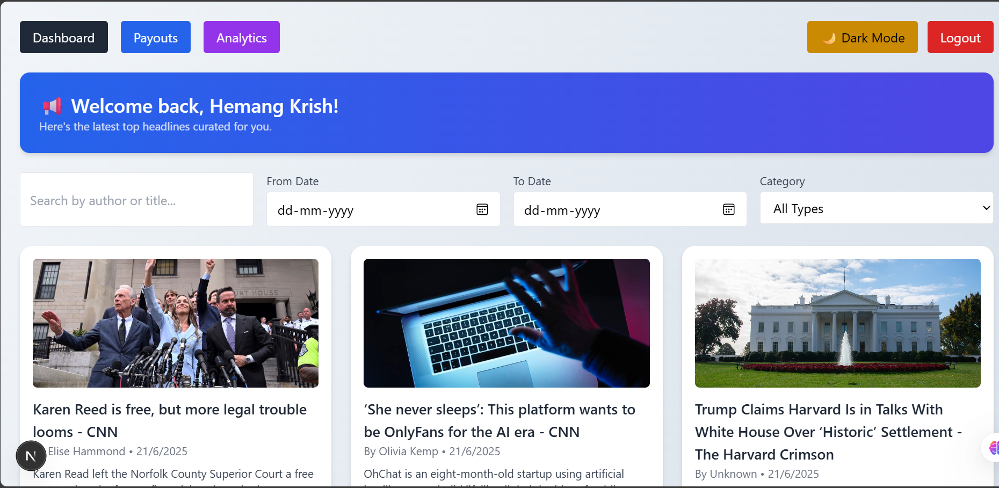
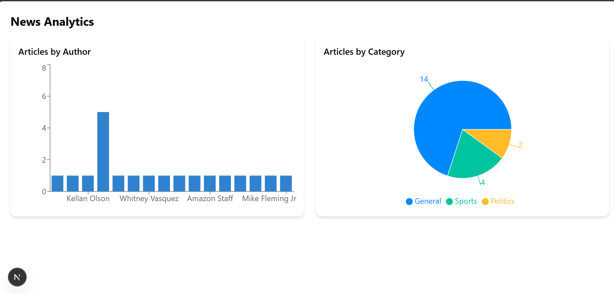
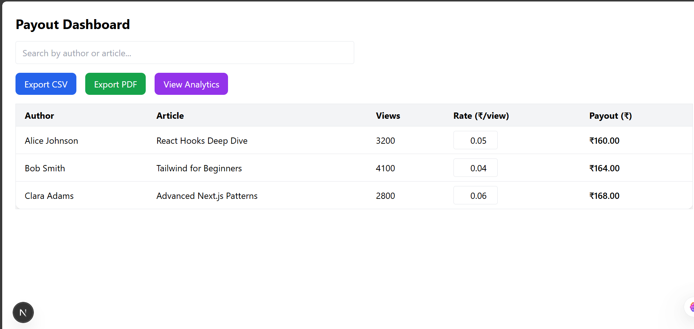

# 📰 News Dashboard with Payout & Analytics

A modern, responsive dashboard built with **Next.js** and **Tailwind CSS**, featuring Google OAuth login, real-time news fetched via NewsAPI, author analytics, article filters, export options (PDF, CSV), admin-only payout calculations, and dark/light mode toggling.

## 🚀 Features

### ✅ User Features
- 🔐 Google Authentication using Firebase
- 📰 Live News Feed from [NewsAPI](https://newsapi.org)
- 🔍 Filter by author, date range, and category
- 🌙 Dark/Light mode with theme persistence
- 📱 Fully responsive UI

### ⚙️ Admin-Only Features
- 💰 Payout Dashboard with inline editing of article payout rates
- 📊 Analytics dashboard with pie/bar charts for article trends
- 📤 Export options: PDF, CSV, and Google Sheets via NocodeAPI

---

## 📸 Screenshots

| Dashboard | Analytics | Payouts |
|----------|------------|---------|
|  |  |  |

---

## 🛠️ Tech Stack

- **Frontend**: Next.js, Tailwind CSS, TypeScript, Framer Motion
- **Auth**: Firebase (Google Sign-In)
- **State Management**: Redux Toolkit
- **API Integration**: [NewsAPI](https://newsapi.org), [NocodeAPI](https://nocodeapi.com) (for Google Sheets)
- **Charts**: Recharts
- **Exporting**: jsPDF, PapaParse (CSV)

---

## 📁 Folder Structure

```
pages/
├── auth/            # Login page
├── admin/           # Admin-only pages (analytics, payouts)
├── dashboard.tsx    # Main user dashboard
redux/
├── slices/          # authSlice, newsSlice
lib/
├── firebase.ts      # Firebase config
styles/
├── globals.css      # Tailwind base styles
```

---

## 🔧 Setup Instructions

1. **Clone the repo**

```bash
git clone https://github.com/YOUR_USERNAME/news_dashboard.github.io.git
cd news_dashboard.github.io
```

2. **Install dependencies**

```bash
npm install
```

3. **Setup Firebase**

Create a file in `lib/firebase.ts` and add your Firebase config.

4. **Create `.env.local`**

```env
NEXT_PUBLIC_NEWS_API_KEY=your_newsapi_key
NEXT_PUBLIC_NOCODEAPI_ENDPOINT=https://v1.nocodeapi.com/your-endpoint?tabId=sheet1
```

5. **Run the app**

```bash
npm run dev
```

Open [http://localhost:3000](http://localhost:3000)

---

## 📦 Deployment

- Recommended: [Vercel](https://vercel.com) (supports Next.js out of the box)
- Or use Netlify, GitHub Pages with static export

---

## 📝 License

This project is licensed under the **MIT License**.  
Feel free to use, modify, and distribute it!

---

## 🙌 Acknowledgements

- [NewsAPI](https://newsapi.org)
- [Firebase](https://firebase.google.com)
- [NocodeAPI](https://nocodeapi.com)
- [Recharts](https://recharts.org)
- [Tailwind CSS](https://tailwindcss.com)
